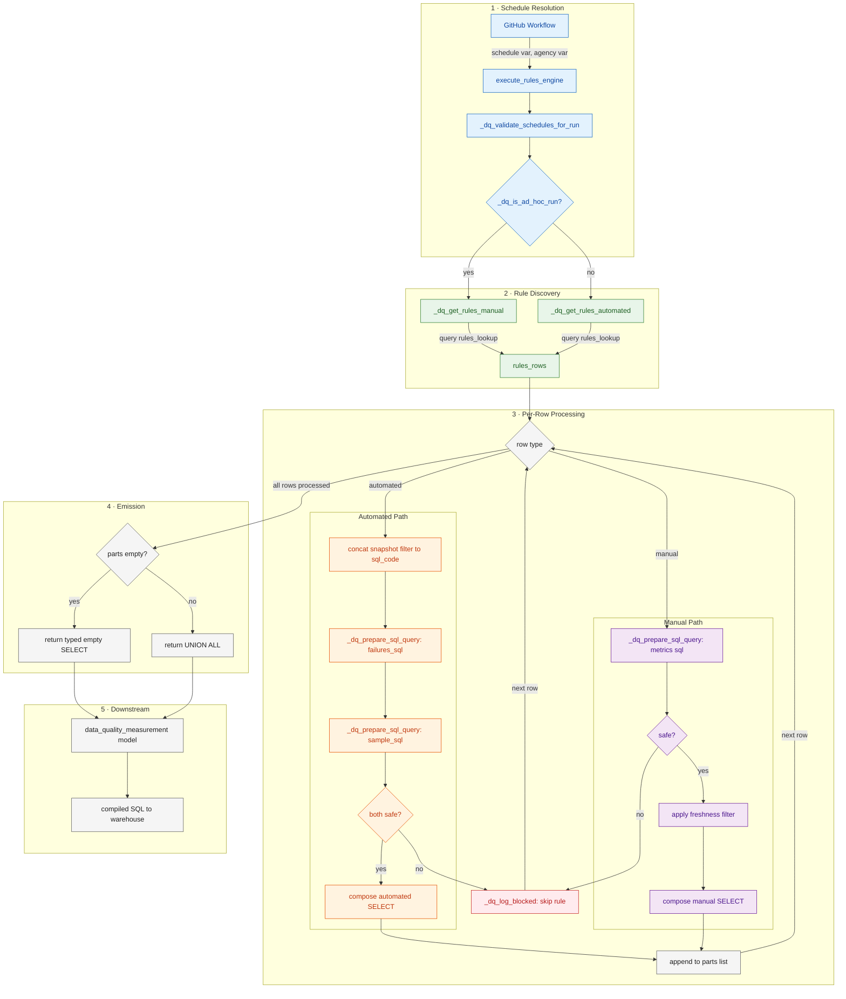

# Data Quality Rules Engine — Engine Internals & Flow

 **Related documentation:**
 - [Overview](dq_rules_engine_overview.md) — architecture, data model, dbt models, schedules, output schema, and configuration
 - [Rule Authoring Guide](dq_rules_engine_authoring_guide.md) — how to write rules and populate metadata tables

This document provides a visual overview of the engine internals: how rule metadata flows through the macros, which helpers transform the data, and what the compiled SQL looks like at the end.

For the data model (ER diagram), see the [Overview](dq_rules_engine_overview.md#data-model).

## 1. Runtime Flow




### 1.1 Example Compiled SQL

Below are simplified excerpts of the SQL statements that `execute_rules_engine` builds once placeholders are resolved and safety checks pass. Each generated statement contributes to the final `UNION ALL` that the downstream `data_quality_measurement` model executes.

Automated allocation example:

```sql
select
  cast('101' as varchar)                                 as allocation_id,
  try_cast((select count(*)
            from my_database.my_table
            where partition_date = '2025-12-01'
              and my_flag = true) as double)                 as failures_count,
  try_cast((select count(*)
            from my_database.my_table
            where partition_date = '2025-12-01' ) as double) as sample_count,
  cast('2025-12-18 12:00:00' as timestamp)                as measurement_timestamp,
  cast('2025-12-18 12:00:00' as timestamp)                as run_ts,
  cast('invocation-abc' as varchar)                       as invocation_id
```

Manual/ad-hoc allocation example (metrics table already contains computed counts):

```sql
select
  cast('102' as varchar)                                 as allocation_id,
  try_cast(failures_count as double)                      as failures_count,
  try_cast(total_sample_count as double)                  as sample_count,
  try(date_parse(measurement_timestamp, '%d/%m/%Y'))      as measurement_timestamp,
  cast('2025-12-18 12:00:00' as timestamp)                as run_ts,
  cast('invocation-abc' as varchar)                       as invocation_id
from (
  select failures_count,
         total_sample_count,
         measurement_timestamp,
         extraction_timestamp
  from manual_metrics_database.manual_metrics_table
) 
where date_parse(extraction_timestamp, '%Y%m%d%H%i%sZ')
      > timestamp '2025-12-17 00:00:00'
```

When any safe statements exist, `execute_rules_engine` returns `union all`'ed fragments such as the two above; otherwise it generates a typed `select ... where false` placeholder that ensures the model has empty sql to compile and run.

### Stage Breakdown

| Stage | Macro / helper | Purpose |
|-------|----------------|---------|
| Schedule handling | `_dq_normalise_schedules`, `_dq_validate_schedules_for_run`, `_dq_is_ad_hoc_run` | Clean incoming schedule vars, prevent mixing automated and ad-hoc runs, and decide which rule set to fetch. |
| Rule discovery | `_dq_get_rules_automated`, `_dq_get_rules_manual` | Query `data_quality_poc__rules_lookup` for automated or manual allocations filtered by the requested schedules, and optionally by `executive_agency_acronym` if `agency` is provided. |
| SQL preparation | `_dq_normalise_sql`, `_dq_apply_placeholders`, `_dq_prepare_sql_query` | Normalise SQL text, substitute `{SOURCE_*}` identifiers, and only return fragments that pass `_dq_is_safe`. |
| Safety logging | `_dq_is_safe`, `_dq_log_blocked` | Block unsafe SQL (non-SELECT, multi-statement, DML/DDL) and log the reason without stopping the run. |
| Part building | `_dq_build_rule_parts` | Core loop: iterates over rules, builds per-rule SQL SELECT parts (automated or manual path), and returns the full list of parts. |
| Batching | Inline in `data_quality_poc__data_quality_measurement` | Splits parts into character-bounded batches; pre-batches are INSERTed directly, final batch is materialised by dbt. |
| Emission | `execute_rules_engine` (thin wrapper) | Joins parts with `UNION ALL` for backward compatibility; the measurement model bypasses this wrapper and uses `_dq_build_rule_parts` directly. |

## 2. How Does It Work?

1. **Schedules in -> Rules out**: `execute_rules_engine` accepts a `schedule` var (defaulting to the `schedule` project var) and an optional `agency` var (defaulting to the `agency` project var). It normalises the schedule, validates that ad-hoc runs are isolated, and routes to the automated or manual rule lookup accordingly — passing `agency` through to filter `data_quality_poc__rules_lookup` to one or more agencies when provided. `agency` accepts a single acronym string or a list of acronym strings; matching is case-insensitive.
2. **Metadata-driven SQL**: `_dq_prepare_sql_query` wraps `_dq_normalise_sql` + `_dq_apply_placeholders`, so the source database/table/field metadata is populated inside each rule's SQL fragment before any safety checking.
3. **Safety**: `_dq_is_safe` enforces single SELECT-only statements and `_dq_log_blocked` records what was rejected, letting the engine continue without unsafe fragments.
4. **Mode-specific shaping**:
  - Automated rules build failures and sample SQL (including optional `source_snapshot_filter` predicates), cast the results to `double`, and emit one row per allocation with `measurement_timestamp` and `run_ts` set to the current run timestamp.
  - Manual/ad-hoc rules read uploader metrics, parse the `extraction_timestamp` via `date_parse`, filter rows newer than `last_success_dbt_run_timestamp`, and cast the returned metrics before adding them to the output.
5. **Standardised output**: Safe statements are UNIONed into the schema (`allocation_id`, `failures_count`, `sample_count`, `measurement_timestamp`, `run_ts`, `invocation_id`); when no statements survive, the macro emits a typed `select ... where false` so downstream models compile safely.

### Audit Path

The `dq_compiled_sql_audit` macro runs in parallel with `execute_rules_engine`. It resolves placeholders and runs safety checks identically, but instead of executing the SQL, it records the compiled SQL text as a string literal. Blocked rules are included with `is_blocked = true` and the raw pre-substitution SQL, so you can inspect exactly what failed validation. This is materialised by the `data_quality_poc__compiled_sql_audit` model.