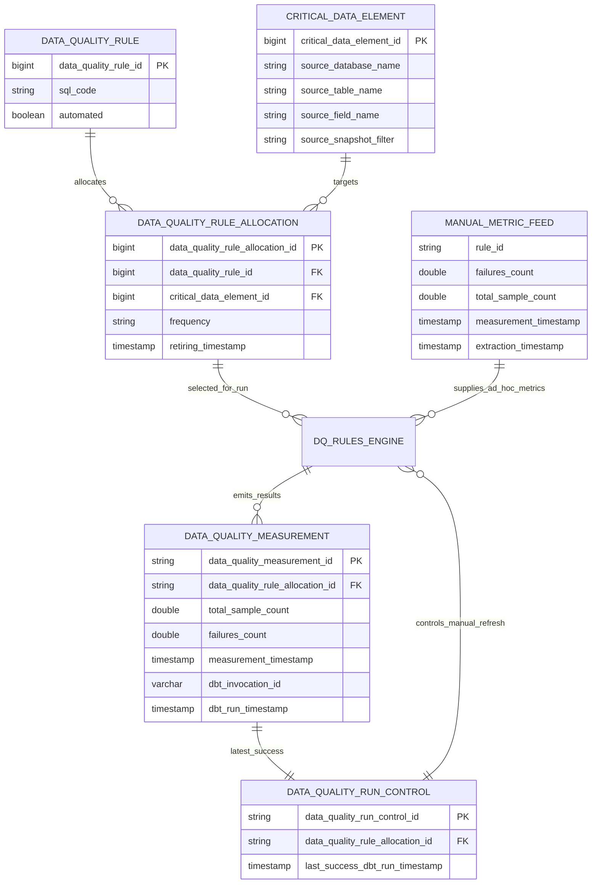

# Data Quality Rules Engine

 **Related documentation:**
 - [Rule Authoring Guide](dq_rules_engine_authoring_guide.md) — how to write rules and populate metadata tables
 - [Engine Internals & Flow](dq_rules_engine_internals.md) — runtime flowchart, macro breakdown, and compiled SQL examples

This document describes the architecture, configuration, and execution of the Data Quality Rules Engine — a set of dbt macros that dynamically execute data quality rules defined in warehouse metadata tables and produce a unified measurement output.

---

## Overview

The engine reads rule definitions and allocations from centrally defined metadata tables, generates SQL for each rule, and returns a `UNION ALL` result. There are two rule types:

### Automated Rules (`automated = true`)

- Evaluate data quality conditions dynamically using SQL.
- Suitable for scheduled `hourly`, `daily`, or `weekly` execution.
- Engine computes:
  - `failures_count` — from the rule's SQL
  - `sample_count` — `count(*)` of the latest snapshot of the source table
- Emit exactly one measurement row per rule allocation per run.
- The denominator query applies the CDE's `source_snapshot_filter` (if set) as a `WHERE` clause over the source table. This is fully configurable per-CDE — no macro changes are needed to support different domains.

### Manual / Ad-Hoc Rules (`automated = false`)

- Read **pre-computed** metrics uploaded manually or from external systems via the MoJ Data Uploader.
- Only run when `schedule = 'ad-hoc'`.
- Each rule's `sql_code` points at its own uploader table (there is no single global feed table).
- For each `data_quality_rule_allocation_id`:
  - If a `last_success_dbt_run_timestamp` exists, only rows with `extraction_timestamp > last_success_dbt_run_timestamp` are ingested.
  - Otherwise (first run), all rows are ingested once.
- Can emit **many** measurement rows per allocation (one per qualifying uploaded metric row).

Both rule types produce the same output schema — see [Output](#output) below.

---

## Data Model



---

## dbt Models

| Model | Type | Purpose |
|---|---|---|
| `data_quality_poc__rules_lookup` | View | Joins rule, allocation, CDE, and run-control tables into a single flattened lookup. Filters out retired allocations. Applies unicode cleaning to `sql_code` and `source_snapshot_filter`. |
| `data_quality_poc__data_quality_measurement__wap` | Incremental (append) | Write-Audit-Publish (WAP) table. Calls `_dq_build_rule_parts()`, splits into character-bounded batches, and writes all rule results. Clears itself at the start of each run for idempotent retries. If any batch fails, this model fails and the target is never touched. |
| `data_quality_poc__data_quality_measurement` | Incremental (append) | Publish step. Simple `SELECT *` from the WAP table with surrogate key. Only runs after the WAP model succeeds completely — provides transactional inserts via dbt DAG ordering. |
| `data_quality_poc__data_quality_run_control` | Table | Derives the `max(dbt_run_timestamp)` per allocation from measurement history. Used by ad-hoc runs for freshness filtering. |
| `data_quality_poc__compiled_sql_audit` | Incremental (append) | Records the compiled SQL for every rule allocation (including blocked rules) for audit and debugging. |

---

## Schedules & Execution

Valid schedule values: `hourly`, `daily`, `weekly`, `ad-hoc`.

### Automated runs

```bash
dbt run --select data_quality_measurement --vars '{schedule: "daily"}'
dbt run --select data_quality_measurement --vars '{schedule: ["daily", "weekly"]}'
```

If no schedule is provided, all automated rules run regardless of their frequency.

### Ad-hoc (manual) runs

```bash
dbt run --select data_quality_measurement --vars '{schedule: "ad-hoc"}'
```

Mixed schedule runs (e.g. `["daily", "ad-hoc"]`) are **not allowed** — the engine will raise a compiler error.

### Filtering by agency

Pass the optional `agency` var to restrict the run to rules belonging to one or more executive agencies. Accepts a single acronym or a list — matching is case-insensitive:

```bash
# single agency
dbt run --select data_quality_measurement --vars '{schedule: "daily", agency: "hmcts"}'

# multiple agencies
dbt run --select data_quality_measurement --vars '{schedule: "daily", agency: ["hmcts", "hmpps"]}'

# works for ad-hoc runs too
dbt run --select data_quality_measurement --vars '{schedule: "ad-hoc", agency: "hmcts"}'
```

Omitting `agency` (the default) returns rules for all agencies.

---

## Output

Results are written to `data_quality_poc__data_quality_measurement`:

| Column | Type | Description |
|---|---|---|
| `data_quality_measurement_id` | varchar | Surrogate key (allocation ID + run timestamp + measurement timestamp) |
| `data_quality_rule_allocation_id` | varchar | Which allocation produced this result |
| `total_sample_count` | double | Total records evaluated (denominator) |
| `failures_count` | double | Number of failing records |
| `measurement_timestamp` | timestamp | When the metric was measured (`run_ts` for automated; parsed from upload for manual) |
| `dbt_invocation_id` | varchar | The dbt invocation that produced this row |
| `dbt_run_timestamp` | timestamp | When the dbt run started |

---

## Configuration Checklist

Before running `execute_rules_engine`, ensure:

1. `data_quality_rule`, `data_quality_rule_allocation`, and `critical_data_element` tables are populated with at least one active rule allocation (retiring timestamp null or future).
2. For automated rules, each CDE's `source_snapshot_filter` correctly identifies the latest snapshot of the source table (e.g. a predicate on a partition column). If blank, the denominator counts all rows.
3. For manual rules, each uploader table referenced in `sql_code` contains the required columns: `failures_count`, `total_sample_count`, `measurement_timestamp`, `extraction_timestamp`.
4. `data_quality_run_control` is created (even if empty) so ad-hoc runs can store `last_success_dbt_run_timestamp` per allocation.
5. The dbt run passes a `schedule` var, or the model runs all automated rules by default.
6. If scoping a run to one or more agencies, pass `agency` as a dbt var containing a single `executive_agency_acronym` value or a list of them. Matching is case-insensitive.
7. Any permissions (select on CDE sources, manual metric tables, control tables) are granted to the dbt role executing the macro.

See the [Rule Authoring Guide](dq_rules_engine_authoring_guide.md) for details on populating the metadata tables.

---

## Batching

When the number of DQ rules grows large, the combined `UNION ALL` query can exceed Athena's 262,144-character limit. The engine handles this automatically via **character-aware batching** combined with a **Write-Audit-Publish (WAP)** pattern for atomicity.

### How it works

1. `_dq_build_rule_parts()` returns one SQL SELECT per rule.
2. The **WAP model** (`__wap`) accumulates parts into batches. A new batch is started whenever adding the next part would push the current batch's total character count over `dq_max_batch_chars`.
3. On incremental runs (WAP table already exists):
   - A `DELETE` clears any data from a prior run (makes retries idempotent).
   - Pre-batches (all except the final batch) are executed as `INSERT INTO` statements directly via `run_query`.
   - The final batch is returned as the model's SQL for dbt to materialise normally.
4. On first runs (WAP table does not yet exist): all parts are returned in a single query for dbt to create the table via CTAS.
5. The **target model** (`data_quality_poc__data_quality_measurement`) only runs after the WAP model succeeds. It performs a simple `SELECT *` from the WAP table, adds the surrogate key, and publishes to the permanent table.

### Failure semantics

| Scenario | Outcome |
|---|---|
| Batch 2 of 3 fails | WAP model fails → target model never runs → measurement table untouched |
| Retry after failure | WAP DELETE clears partial data → all batches re-execute cleanly |
| All batches succeed | WAP complete → target publishes → measurement table updated atomically |

### Configuration

| Variable | Default | Description |
|---|---|---|
| `dq_max_batch_chars` | `200000` | Maximum character count per batch (conservative headroom below Athena's 262,144 limit). Set in `dbt_project.yml`. |

```bash
# Override batch size for a specific run
dbt run --select tag:dq_engine --vars '{schedule: "daily", dq_max_batch_chars: 150000}'
```

### Observability

The engine logs batch progress to the dbt console:

```
DQ rules engine: 120 rule(s) found for schedule=daily.
DQ WAP: clearing previous run data...
DQ WAP: 120 rule(s) split into 3 batch(es).
DQ WAP batch 1/3: inserting 45 rule(s) (198432 chars)...
DQ WAP batch 1/3: complete.
DQ WAP batch 2/3: inserting 45 rule(s) (195120 chars)...
DQ WAP batch 2/3: complete.
DQ WAP batch 3/3 (final): 30 rule(s) via dbt materialisation.
```

---

## DEVELOPMENT NOTES: Known Limitations & Next Steps

- **~~Athena query size limit:~~** ~~we anticipate hitting Athena limits once the query approaches ~260,000 characters.~~ **Resolved** — character-aware batching is now implemented (see [Batching](#batching) above).
- **Mixed automated + manual runs:** current implementation requires separate runs. We envisage the manual run will execute twice daily to pick up uploaded metrics, while scheduled runs execute at their configured frequency. All are orchestrated via GitHub Action workflows.
- **Rule complexity:** As rules are growing in complexity, it may well be that we have to revisit the structure. Currently we do not accept the use of CTEs due to how the various strings are concatenated. We also need to be mindful of the sample size (denominator) query - with many rules now requiring joins to generate the fails, it may be that using the same `source_snapshot_filter` does not provide us with the correct sample size. A simple solution would be to hardcode this alongside the `sql_code` and we then simply pass this SQL to the engine to execute a deterministic sample size.
- **Partial failure resilience:** If a rule's SQL compiles but errors at runtime (e.g. source table dropped, permission revoked), the entire `UNION ALL` fails and no measurements are recorded for that run. Two potential approaches:

  **Option A — Pre-compile check per rule.** Before adding a rule to the `UNION ALL`, run a cheap `SELECT 1 FROM {source_table} LIMIT 1` via `run_query()` wrapped in a Jinja `try`/`except`. If it fails, log the rule as blocked (reuse `dq_log_blocked`) and exclude it from the batch. To avoid running one probe per rule, we could cache results per unique source table:

  ```jinja
  {# probe once per unique source table #}
  
  
    
    
      
      
    
    
      {# log as blocked, skip #}
    
  
  ```

  - *Pros:* Near-zero Athena cost per check; fits cleanly into the existing loop and blocked-rule logging path; no change to the `UNION ALL` architecture. With the per-table cache, 100 rules across 10 source tables results in only 10 probes.
  - *Cons:* Only catches table-level failures (dropped table, permission revoked). Does not catch column renames, type mismatches, or errors in complex rule SQL.

  **Option B — Per-rule execution via `run_query()`.** Execute each rule's SQL individually inside the loop, capture the result or error, then build the output from collected results rather than a single `UNION ALL`.
  - *Pros:* Full error isolation — any rule can fail without affecting others. Errors can be logged per rule with the specific failure message.
  - *Cons:* Doubles the number of Athena queries (one per rule instead of one batch). Significantly increases compile-time cost and dbt run duration. Would require restructuring the macro's output mechanism.


